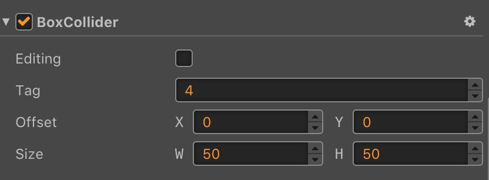
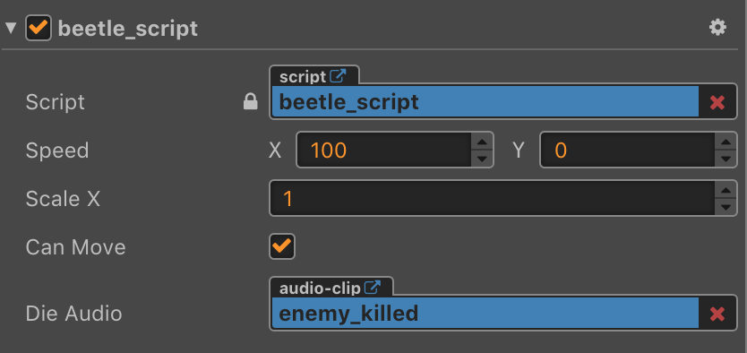

# landscape game

This tutorial demonstrates how to use CocosCreator to create a landscape game similar to Super Mario, and you will get familiar with the following components.

[TileMap](https://docs.cocos.com/creator/manual/en/asset-workflow/tiledmap.html)

[Collision System](https://docs.cocos.com/creator/manual/en/physics/collision/)

[Prefab](https://docs.cocos.com/creator/manual/en/asset-workflow/prefab.html)

[Keyboard Event](https://docs.cocos.com/creator/manual/en/scripting/player-controls.html#keyboard-events)

[Atlas](https://docs.cocos.com/creator/manual/en/asset-workflow/atlas.html)

This tutorial is based on the Cocos Creator v2.x version, click [Download](https://cocos2d-x.org/download) and install it.

## Start our game production

Let's take a look at the effects we finally achieved (all art resources come to the Internet). 

## Game Scene Design

Referring to Super Marie's worldview, we build our world node tree in [Node Manager](https://docs.cocos.com/creator/manual/en/content-workflow/node-tree.html) first,  add Camera,  background layer,  world root, map, and role node.


### Add Camera (Main Camera)

The camera acts as a window for the player to observe the game world. By default, Creator automatically assigns a [camera](https://docs.cocos.com/creator/manual/en/render/camera.html) to the scene, which we don't need to add manually.

### Add World Root (World Root)

Add an empty node and rename  World Root, to place the object nodes in the game.

1. Create the script world.ts and drag it into the node properties panel, then configure the game world parameters, such as setting the value of the gravitational acceleration G.
2. Create the script lookat.ts and drag it into the node properties panel to synchronize the world perspective based on the location of the Player node. 

Global configuration world.ts code:

```typescript

Const {ccclass, property} = cc._decorator;

@ccclass
Export default class CWorld extends cc.Component {

    @property()
    WorldFallG: number = 0;

    @property()
    WorldWalkA: number = 0;

    Static G: number = 0;
    Static WalkA: number = 0;
    
    // LIFE-CYCLE CALLBACKS:

    onLoad () {
        CWorld.G = this.WorldFallG;
        CWorld.WalkA = this.WorldWalkA;
    }

    Start () {
        // enable Collision System
        cc.director.getCollisionManager().enabled = true;
        cc.director.getCollisionManager().enabledDebugDraw = true;
        cc.director.getCollisionManager().enabledDrawBoundingBox = true;
    }

    // update (dt) {}
}
```

World perspective control lookat.ts code:

```typescript
Const { ccclass, property } = cc._decorator;

@ccclass
Export default class NewClass extends cc.Component {

    @property(cc.Node)
    Target: cc.Node = null;

    @property(cc.Node)
    Map: cc.Node = null;

    boundingBox: cc.Rect = null;
    screenMiddle: cc.Vec2 = null;

    minX: number = 0;
    maxX: number = 0;
    minY: number = 0;
    maxY: number = 0;

    isRun: boolean = true;

    // LIFE-CYCLE CALLBACKS:

    onLoad() {
        this.boundingBox = new cc.Rect(0, 0, this.map.width, this.map.height);
        Let winsize = cc.winSize;
        this.screenMiddle = new cc.Vec2(winsize.width / 2, winsize.height / 2);
        this.minX = -(this.boundingBox.xMax - winsize.width);
        this.maxX = this.boundingBox.xMin;
        this.minY = -(this.boundingBox.yMax - winsize.height);
        this.maxY = this.boundingBox.yMin;
    }

    Update() {
        If (!this.isRun)
            Return;
            
        Let pos = this.node.convertToWorldSpaceAR(cc.Vec2.ZERO);
        Let targertPos = this.target.convertToWorldSpaceAR(cc.Vec2.ZERO);
        Let dis = pos.sub(targertPos);
        Let dest = this.screenMiddle.add(dis);
        Dest.x = cc.misc.clampf(dest.x, this.minX, this.maxX);
        Dest.y = this.minY;
        This.node.position = this.node.parent.convertToNodeSpaceAR(dest);
    }
}
```
### Adding a role (Player)

The Player node we control is the focus of the game world perspective.

### Adding a map (Tiled Map)

[The map resource level01 is created by [Tiled](https://www.mapeditor.org/) (supports TiledMap v1.0) , now dragged level01 into the world node. The map node will be generated automatically. At this time, you can view map levels by expand TiledMap. 


According to the object type designed by TiledMap, we need to instantiate the object. We create the waorldmap.ts script to do the work. The following figure shows the Prefab resources bind for the map level objects we have configured in [Tiled](https://www.mapeditor.org/) (supports TiledMap v1.0).


The instantiation of a map object is divided into several steps:

- Prefab resources corresponding to the instantiation type
- Set up a collision group
- Set the object size
- Add collision components
- Set the type tag of the object

In waorldmap.ts, the instantiation of a water object is as follows:

```typescript
// get waters layer and traverse all water objects.
Var waters = this.worldMap.getObjectGroup(this.waterLayerName);
For (var i = 1; i < 8; i++) {
  Var waterName = 'water' + i;
  Var waterBlock = waters.getObject(waterName);
  Var waterNode = cc.instantiate(this.ColliderPreName);

  // set group name for Collider System.
  waterNode.group = 'water';
  
  // set size
  waterNode.width = waterBlock.width;
  waterNode.height = waterBlock.height;
  waterNode.x = waterBlock.x;
  waterNode.y = waterBlock.y - waterBlock.height;
  
  // add collider component.
  waterNode.addComponent(cc.BoxCollider);
  waterNode.getComponent(cc.BoxCollider).size = cc.size(waterNode.width, waterNode.height);
  waterNode.getComponent(cc.BoxCollider).offset =
    New cc.Vec2(waterNode.width / 2, -waterNode.height / 2);

  // set tag for check when collision.
  waterNode.getComponent(cc.BoxCollider).tag = 6;
  this.node.addChild(waterNode);
}
```

### Add collision rules

World objects contain characters, ground, squares, gold coins, beetles, water, mushrooms, now create collision groups and collision groups to constrain the collision rules between objects.


## Game Object Design

The game objects are classified into Prefab according to their own characteristics. The Prefab add the following contents according to the characteristics of the objects:

- Collision
- Animation
- Sound
- Behavior

### Object Prefab production

For example, here is the Beetle's resource directory, which contains the Beetle animation file **beetle_anim**, the Prefab resource **beetle_node**, the skin file **beetle_skin**, the behavior control script **beetle_script**.

|

Add action components to the beetle Prefab


Add a collision component to the beetle Prefab



Add a script component to the Beetle Prefab to set the speed, zoom factor, sound effects, etc.



Below is the production of the Beetle script for collision detection and behavior control.

```typescript
Const { ccclass, property } = cc._decorator;

@ccclass
Export default class enemy extends cc.Component {
    @property()
    Speed: cc.Vec2 = new cc.Vec2(0, 0);

    @property
    scaleX: number = 1;

    @property
    canMove: boolean = true;

    @property({type: cc.AudioClip})
    dieAudio: cc.AudioClip = null;

    Anim: cc.Animation = null;

    // LIFE-CYCLE CALLBACKS:

    onLoad() {
        this.node.scaleX = 1;
        This.anim = this.getComponent(cc.Animation);
    }

    Start() {

    }

    // onCollisionEnter overrated
    onCollisionEnter(other, self) {
        If (other.tag == 5) {
            This.turn();
            This.speed.x = -this.speed.x;
        }

        Var otherAabb = other.world.aabb;
        Var otherPreAabb = other.world.preAabb.clone();

        Var selfAabb = self.world.aabb;
        Var selfPreAabb = self.world.preAabb.clone();
        selfPreAabb.y = selfAabb.y;
        otherPreAabb.y = otherAabb.y;

        If (cc.Intersection.rectRect(selfPreAabb, otherPreAabb)) {
            If (selfPreAabb.yMax < otherPreAabb.yMax && other.node.group == 'player') {
                This.todie();
            }
        }
    }

    Todie() {
        cc.audioEngine.play(this.dieAudio, false, 1);
        This.anim.play('beetled');
        this.canMove = false;
        This.node.height = this.node.height * 0.3;
      
        this.node.runAction(cc.fadeOut(.5));
        this.scheduleOnce(function () {
            this.node.removeFromParent();
        }, 0.5);
    }

    Update(dt) {
        If (this.canMove) {
            This.node.x -= this.speed.x * dt;
        }
    }

    Turn() {
        this.node.scaleX = -this.node.scaleX;
    }
}
```
### Role Logic Design

As the core of the game, the role's behavior design is more complicated, mainly divided into two parts: control events and collision events.

#### Control event handling

```typescript
onLoad() {
  cc.systemEvent.on(cc.SystemEvent.EventType.KEY_DOWN, this.onKeyDown, this);
  cc.systemEvent.on(cc.SystemEvent.EventType.KEY_UP, this.onKeyUp, this);
}

onDestroy() {
  cc.systemEvent.off(cc.SystemEvent.EventType.KEY_DOWN, this.onKeyDown, this);
  cc.systemEvent.off(cc.SystemEvent.EventType.KEY_UP, this.onKeyUp, this);
}

onKeyDown(event) {
  Switch (event.keyCode) {
    Case cc.macro.KEY.a:
    Case cc.macro.KEY.left:
      this.playerLeft();
      Break;
    Case cc.macro.KEY.d:
    Case cc.macro.KEY.right:
      this.playerRight();
      Break;
    Case cc.macro.KEY.w:
    Case cc.macro.KEY.up:
      this.playerUp();
      Break;
    Case cc.macro.KEY.down:
    Case cc.macro.KEY.s:
      this.playerDown();
      Break;
  }
}

onKeyUp(event) {
  Switch (event.keyCode) {

    Case cc.macro.KEY.a:
    Case cc.macro.KEY.left:
    Case cc.macro.KEY.d:
    Case cc.macro.KEY.right:
      this.noLRControlPlayer();
      Break;
    Case cc.macro.KEY.up:
    Case cc.macro.KEY.w:
      this.noUpControlPlayer();
      Break;
    Case cc.macro.KEY.s:
    Case cc.macro.KEY.down:
      this.noDownControlPlayer();
      Break;
  }
}
```

#### Collision event processing

The object is assigned an object type tag when instantiated, and the following code assigns different collision logic based on the tag.

```typescript
 onCollisionEnter(other, self) {
   If (this.touchingNumber == 0) {
     If (this.buttonIsPressed)
       This.player_walk();
     Else
       This.player_idle();
   }
   Switch (other.tag) {
     Case 1://coin.tag = 1
       this.collisionCoinEnter(other, self);
       Break;
     Case 2://bonusblock6.tag = 2
     Case 3://breakableWall = 3
     Case 7: //bonusblock6withMushroom.tag = 7
       this.collisionBonusWallEnter(other, self);
       Break;
     Case 4://enemy.tag = 4
       this.collisionEnemyEnter(other, self);
       Break;
     Case 5://platform.tag = 5
       this.collisionPlatformEnter(other, self);
       Break;
     Case 6://water.tag = 6
       this.collisionWaterEnter(other, self);
       Break;
     Case 8://mushroom.tag = 8
       this.collisionMushroomEnter(other, self);
       Break;
   }
 }
```
Collision between the character and the ground:

```typescript
collisionPlatformEnter(other, self) {
  this.touchingNumber++;
  this.jumpCount = 0;
  Var otherAabb = other.world.aabb;
  Var otherPreAabb = other.world.preAabb.clone();
  Var selfAabb = self.world.aabb;
  Var selfPreAabb = self.world.preAabb.clone();
  selfPreAabb.x = selfAabb.x;
  otherPreAabb.x = otherAabb.x;

  If (cc.Intersection.rectRect(selfPreAabb, otherPreAabb)) {

    If (this._speed.x < 0 && (selfPreAabb.xMax > otherPreAabb.xMax)) {
      This.node.x += Math.floor(Math.abs(otherAabb.xMax - selfAabb.xMin));
      this.collisionX = -1;
    }
    Else if (this._speed.x > 0 && (selfPreAabb.xMin < otherPreAabb.xMin)) {
      This.node.x -= Math.floor(Math.abs(otherAabb.xMin - selfAabb.xMax));
      this.collisionX = 1;
    } else if (this._speed.x == 0 && (selfPreAabb.xMax == otherPreAabb.xMin)) {
      this.isFallDown = true;
    }

    This._speed.x = 0;
    other.touchingX = true;
    Return;
  }
  selfPreAabb.y = selfAabb.y;
  otherPreAabb.y = otherAabb.y;

  If (cc.Intersection.rectRect(selfPreAabb, otherPreAabb)) {
    If (this._speed.y < 0 && (selfPreAabb.yMax > otherPreAabb.yMax)) {
      This.node.y = otherPreAabb.yMax - this.node.parent.y;
      this.isJumping = false;
      this.collisionY = -1;
    }
    Else if (this._speed.y > 0 && (selfPreAabb.yMin < otherPreAabb.yMin)) {
      cc.audioEngine.play(this.hit_block_Audio, false, 1);
      This.node.y = otherPreAabb.yMin - selfPreAabb.height - this.node.parent.y;
      this.collisionY = 1;
    }

    This._speed.y = 0;
    other.touchingY = true;
  }
  this.isWallCollisionCount++;
}
```

Collision between character and enemy

```typescript
collisionEnemyEnter(other, self) {
  // 1st step
  // get pre aabb, go back before collision
  Var otherAabb = other.world.aabb;
  Var otherPreAabb = other.world.preAabb.clone();

  Var selfAabb = self.world.aabb;
  Var selfPreAabb = self.world.preAabb.clone();

  // 2nd step
  // forward x-axis, check whether collision on x-axis
  selfPreAabb.x = selfAabb.x;
  otherPreAabb.x = otherAabb.x;
  If (cc.Intersection.rectRect(selfPreAabb, otherPreAabb)) {
    If (this._life == 2) {
      cc.audioEngine.play(this.player_decrease_Audio, false, 1);
      Var actionBy = cc.scaleBy(1, 3 / 5);
      this.node.runAction(actionBy);
      This._life--;
    } else if (this._life == 1) {
      This.anim.play("player_die");
      this.rabbitDieJump();
      this.OverNodeLoad();
      Return;
    }

    If (this._speed.x < 0 && (selfPreAabb.xMax > otherPreAabb.xMax)) {
      This.node.x += Math.floor(Math.abs(otherAabb.xMax - selfAabb.xMin));
      this.collisionX = -1;
    }
    Else if (this._speed.x > 0 && (selfPreAabb.xMin < otherPreAabb.xMin)) {
      This.node.x -= Math.floor(Math.abs(otherAabb.xMin - selfAabb.xMax));
      this.collisionX = 1;
    }

    This._speed.x = 0;
    other.touchingX = true;
    Return;
  }

  // 3rd step
  // forward y-axis, check whether collision on y-axis
  selfPreAabb.y = selfAabb.y;
  otherPreAabb.y = otherAabb.y;

  If (cc.Intersection.rectRect(selfPreAabb, otherPreAabb)) {
    If (this._speed.y < 0 && (selfPreAabb.yMax > otherPreAabb.yMax)) {
      this.rabbitJump();
      Return;
    }
    
    If (this._speed.y > 0 && (selfPreAabb.yMax < otherPreAabb.yMax)) {
      If (this._life == 2) {
        Var actionBy = cc.scaleBy(1, 3 / 5);
        this.node.runAction(actionBy);
        This._life--;
      } else if (this._life == 1) {
        This.anim.play("player_die");
        this.rabbitDieJump();
        this.OverNodeLoad();
        Return;
      }
    }
    
    This._speed.y = 0;
    other.touchingY = true;
  }
  this.isWallCollisionCount++;
}
```

## At last

This tutorial is mainly to explain how to use the CocosCreator editor to design a landscape game, use the creator componentization ideas, reduce the use of code, provide development efficiency, the code of this tutorial can be downloaded here [download](https: / /github.com/xianyinchen/creator_teach), resources come to the network, please do not use for commercial purposes.