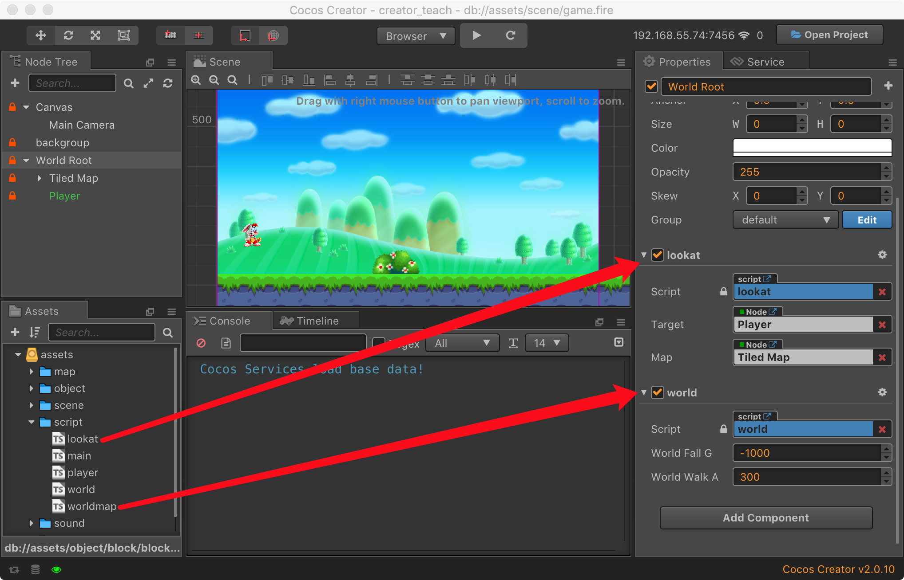
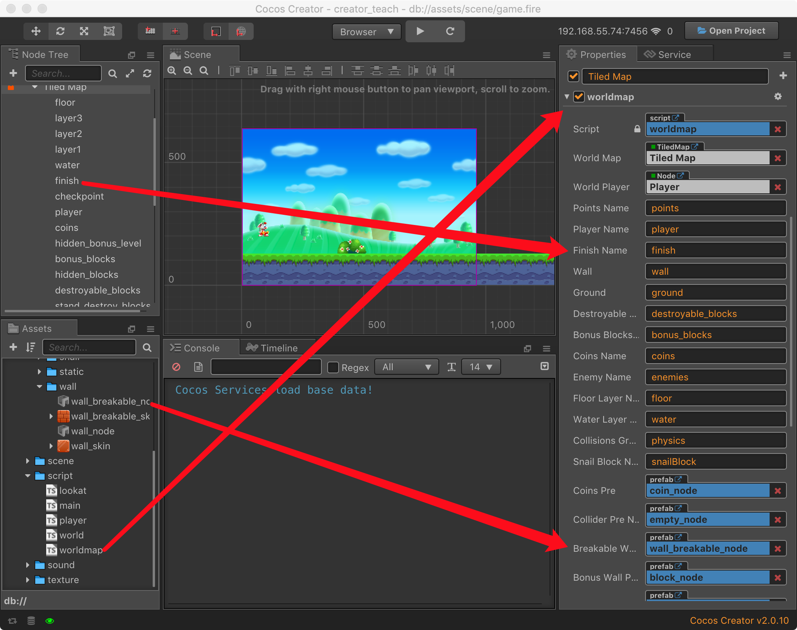
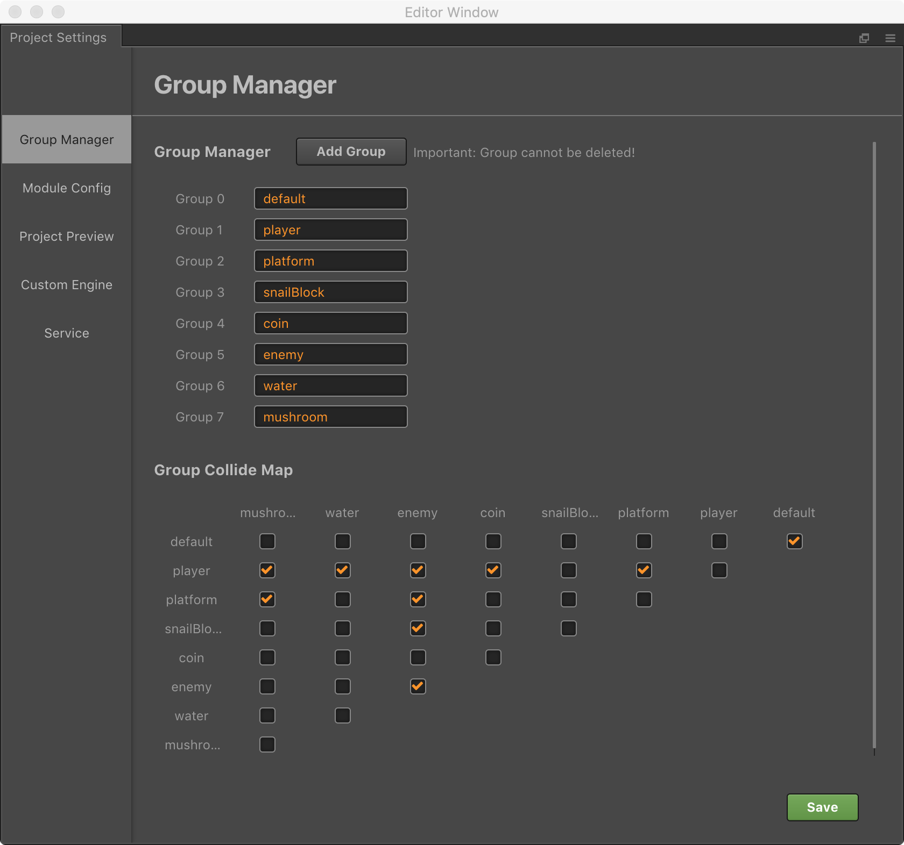

## 横版游戏

本教程演示如何灵活快速的使用 CocosCreator 来创作类似超级玛丽的横版游戏，这个教程可以帮助熟悉下面这些组件。

[TileMap](https://docs.cocos.com/creator/manual/en/asset-workflow/tiledmap.html)

[Collision System](https://docs.cocos.com/creator/manual/en/physics/collision/)

[Prefab](https://docs.cocos.com/creator/manual/en/asset-workflow/prefab.html)

[Keyboard Event](https://docs.cocos.com/creator/manual/en/scripting/player-controls.html#keyboard-events)

[Atlas](https://docs.cocos.com/creator/manual/en/asset-workflow/atlas.html)

该教程基于 Cocos Creator v2.x 版本，点击[下载](https://cocos2d-x.org/download)并安装。

## 开始我们的游戏制作

先看下我们最后实现的效果(美术资源来至互联网)。

## 游戏场景设计

参考超级玛丽的世界观，我们先在[节点管理器](https://docs.cocos.com/creator/manual/en/content-workflow/node-tree.html)构建我们的世界节点树，我们添加了摄像机，游戏背景层，世界根节点，地图节点，角色节点。


### 添加摄像机(Main Camera)

摄像机作为玩家观察游戏世界的窗口，Creator默认会自动为场景分配一个[摄像机](https://docs.cocos.com/creator/manual/en/render/camera.html) ，我们无需手动添加。

### 添加世界根节点(World Root)

添加一个空节点，用于放置游戏内的物体节点。

1. 创建脚本world.ts并拖入节点属性面板，用于配置游戏世界参数，比如设置重力加速度G的值。
2. 创建脚本lookat.ts并拖入节点属性面板，根据Player节点的位置同步世界视角。

全局配置 world.ts 代码：

```typescript

const {ccclass, property} = cc._decorator;

@ccclass
export default class CWorld extends cc.Component {

    @property()
    WorldFallG: number = 0;    

    @property() 
    WorldWalkA: number = 0;

    static G: number = 0;    
    static WalkA: number = 0; 
    
    // LIFE-CYCLE CALLBACKS:

    onLoad () {
        CWorld.G = this.WorldFallG;    
        CWorld.WalkA = this.WorldWalkA; 
    }

    start () {
        // enable Collision System
        cc.director.getCollisionManager().enabled = true;
        cc.director.getCollisionManager().enabledDebugDraw = true;
        cc.director.getCollisionManager().enabledDrawBoundingBox = true;
    }

    // update (dt) {}
}
```

世界视角控制 lookat.ts 代码：

```typescript
const { ccclass, property } = cc._decorator;

@ccclass
export default class NewClass extends cc.Component {

    @property(cc.Node)
    target: cc.Node = null;

    @property(cc.Node)
    map: cc.Node = null;

    boundingBox: cc.Rect = null;
    screenMiddle: cc.Vec2 = null;

    minX: number = 0;
    maxX: number = 0;
    minY: number = 0;
    maxY: number = 0;

    isRun: boolean = true;

    // LIFE-CYCLE CALLBACKS:

    onLoad() {
        this.boundingBox = new cc.Rect(0, 0, this.map.width, this.map.height);
        let winsize = cc.winSize;
        this.screenMiddle = new cc.Vec2(winsize.width / 2, winsize.height / 2);
        this.minX = -(this.boundingBox.xMax - winsize.width);
        this.maxX = this.boundingBox.xMin;
        this.minY = -(this.boundingBox.yMax - winsize.height);
        this.maxY = this.boundingBox.yMin;
    }

    update() {
        if (!this.isRun) 
            return;
            
        let pos = this.node.convertToWorldSpaceAR(cc.Vec2.ZERO);
        let targertPos = this.target.convertToWorldSpaceAR(cc.Vec2.ZERO);
        let dis = pos.sub(targertPos);
        let dest = this.screenMiddle.add(dis);
        dest.x = cc.misc.clampf(dest.x, this.minX, this.maxX);
        dest.y = this.minY;
        this.node.position = this.node.parent.convertToNodeSpaceAR(dest);
    }
}
```

### 添加角色(Player)

我们控制的游戏主角节点，作为游戏世界视角的焦点。

### 添加地图(Tiled Map)

将 [Tiled](https://www.mapeditor.org/) (支持 TiledMap v1.0) 制作好的地图资源 level01，拖入到世界节点下面，自动会生成地图节点，这时候可以查看展开的TiledMap地图层级。


根据 TiledMap 设计的物体类型，需要对物体进行实例化，我们创建waorldmap.ts脚本来完成这个工作，下图是我们已配置的地图层级和物体的Prefab资源。



地图对象的实例化，分为几步：

- 实例化类型对应的Prefab资源
- 设置碰撞组
- 设置物体大小
- 添加碰撞组件
- 设置物体的类型标签

在waorldmap.ts 中，水对象的实例化过程如下：

```typescript
// get waters layer and traverse all water objects.
var waters = this.worldMap.getObjectGroup(this.waterLayerName);
for (var i = 1; i < 8; i++) {
  var waterName = 'water' + i;
  var waterBlock = waters.getObject(waterName);
  var waterNode = cc.instantiate(this.ColliderPreName);

  // set group name for Collider System.
  waterNode.group = 'water';
  
  // set size
  waterNode.width = waterBlock.width;
  waterNode.height = waterBlock.height;
  waterNode.x = waterBlock.x;
  waterNode.y = waterBlock.y - waterBlock.height;
  
  // add collider component.
  waterNode.addComponent(cc.BoxCollider);
  waterNode.getComponent(cc.BoxCollider).size = cc.size(waterNode.width, waterNode.height);
  waterNode.getComponent(cc.BoxCollider).offset = 
    new cc.Vec2(waterNode.width / 2, -waterNode.height / 2);

  // set tag for check when collision. 
  waterNode.getComponent(cc.BoxCollider).tag = 6;
  this.node.addChild(waterNode);
}
```

### 添加碰撞规则

世界物体包含了角色，地面，方块，金币，甲壳虫，水，蘑菇，创建碰撞组和碰撞组来约束物体彼此之间碰撞规则。



## 游戏物体设计

游戏物体会根据本身的特性去进行分类做成预制体，预制体根据物体特性，添加下面内容：

- 碰撞特性
- 动作表现
- 音效表现
- 行为控制脚本

### 物体Prefab制作

例如下面是甲壳虫的资源目录，包含了甲壳虫动画文件 **beetle_anim**，预制体资源 **beetle_node**，皮肤文件 **beetle_skin**，行为控制脚本 **beetle_script**。

|

给甲壳虫预制体添加动作组件


给甲壳虫预制体添加碰撞组件


给甲壳虫预制体添加脚本组件，设置了移动速度，缩放系数，音效等属性


下面是制作甲壳虫脚本，用于碰撞检测和行为控制

```typescript
const { ccclass, property } = cc._decorator;

@ccclass
export default class enemy extends cc.Component {
    @property()
    speed: cc.Vec2 = new cc.Vec2(0, 0);

    @property
    scaleX: number = 1;

    @property
    canMove: boolean = true;

    @property({type: cc.AudioClip})
    dieAudio: cc.AudioClip = null;

    anim: cc.Animation = null;

    // LIFE-CYCLE CALLBACKS:

    onLoad() {
        this.node.scaleX = 1;
        this.anim = this.getComponent(cc.Animation);
    }

    start() {

    }

    // onCollisionEnter overrated
    onCollisionEnter(other, self) {
        if (other.tag == 5) {
            this.turn();
            this.speed.x = -this.speed.x;
        }

        var otherAabb = other.world.aabb;
        var otherPreAabb = other.world.preAabb.clone();

        var selfAabb = self.world.aabb;
        var selfPreAabb = self.world.preAabb.clone();
        selfPreAabb.y = selfAabb.y;
        otherPreAabb.y = otherAabb.y;

        if (cc.Intersection.rectRect(selfPreAabb, otherPreAabb)) {
            if (selfPreAabb.yMax < otherPreAabb.yMax && other.node.group == 'player') {
                this.todie();
            }
        }
    }

    todie() {
        cc.audioEngine.play(this.dieAudio, false, 1);
        this.anim.play('beetled');
        this.canMove = false;
        this.node.height = this.node.height * 0.3;
      
        this.node.runAction(cc.fadeOut(.5));
        this.scheduleOnce(function () {
            this.node.removeFromParent();
        }, 0.5);
    }

    update(dt) {
        if (this.canMove) {
            this.node.x -= this.speed.x * dt;
        }
    }

    turn() {
        this.node.scaleX = -this.node.scaleX;
    }
}
```

### 角色逻辑设计

作为游戏的核心，角色的行为设计是比较复杂，主要分为控制事件和碰撞事件两部分。

#### 控制事件处理

```typescript
onLoad() {
  cc.systemEvent.on(cc.SystemEvent.EventType.KEY_DOWN, this.onKeyDown, this);
  cc.systemEvent.on(cc.SystemEvent.EventType.KEY_UP, this.onKeyUp, this);
}

onDestroy() {
  cc.systemEvent.off(cc.SystemEvent.EventType.KEY_DOWN, this.onKeyDown, this);
  cc.systemEvent.off(cc.SystemEvent.EventType.KEY_UP, this.onKeyUp, this);
}

onKeyDown(event) {
  switch (event.keyCode) {
    case cc.macro.KEY.a:
    case cc.macro.KEY.left:
      this.playerLeft();
      break;
    case cc.macro.KEY.d:
    case cc.macro.KEY.right:
      this.playerRight();
      break;
    case cc.macro.KEY.w:
    case cc.macro.KEY.up:
      this.playerUp();
      break;
    case cc.macro.KEY.down:
    case cc.macro.KEY.s:
      this.playerDown();
      break;
  }
}

onKeyUp(event) {
  switch (event.keyCode) {

    case cc.macro.KEY.a:
    case cc.macro.KEY.left:
    case cc.macro.KEY.d:
    case cc.macro.KEY.right:
      this.noLRControlPlayer();
      break;
    case cc.macro.KEY.up:
    case cc.macro.KEY.w:
      this.noUpControlPlayer();
      break;
    case cc.macro.KEY.s:
    case cc.macro.KEY.down:
      this.noDownControlPlayer();
      break;
  }
}
```

#### 碰撞事件处理

物体对象在实例化时候分配了物体类型标签，下面代码根据标签来指派不同的碰撞逻辑。

```typescript
 onCollisionEnter(other, self) {
   if (this.touchingNumber == 0) {
     if (this.buttonIsPressed)
       this.player_walk();
     else
       this.player_idle();
   }
   switch (other.tag) {
     case 1://coin.tag = 1
       this.collisionCoinEnter(other, self);
       break;
     case 2://bonusblock6.tag = 2
     case 3://breakableWall = 3
     case 7: //bonusblock6withMushroom.tag = 7
       this.collisionBonusWallEnter(other, self);
       break;
     case 4://enemy.tag = 4
       this.collisionEnemyEnter(other, self);
       break;
     case 5://platform.tag = 5
       this.collisionPlatformEnter(other, self);
       break;
     case 6://water.tag = 6
       this.collisionWaterEnter(other, self);
       break;
     case 8://mushroom.tag = 8
       this.collisionMushroomEnter(other, self);
       break;
   }
 }
```

角色与地面的碰撞处理:

```typescript
collisionPlatformEnter(other, self) {
  this.touchingNumber++;
  this.jumpCount = 0;
  var otherAabb = other.world.aabb;
  var otherPreAabb = other.world.preAabb.clone();
  var selfAabb = self.world.aabb;
  var selfPreAabb = self.world.preAabb.clone();
  selfPreAabb.x = selfAabb.x;
  otherPreAabb.x = otherAabb.x;

  if (cc.Intersection.rectRect(selfPreAabb, otherPreAabb)) {

    if (this._speed.x < 0 && (selfPreAabb.xMax > otherPreAabb.xMax)) {
      this.node.x += Math.floor(Math.abs(otherAabb.xMax - selfAabb.xMin));
      this.collisionX = -1;
    }
    else if (this._speed.x > 0 && (selfPreAabb.xMin < otherPreAabb.xMin)) {
      this.node.x -= Math.floor(Math.abs(otherAabb.xMin - selfAabb.xMax));
      this.collisionX = 1;
    } else if (this._speed.x == 0 && (selfPreAabb.xMax == otherPreAabb.xMin)) {
      this.isFallDown = true;
    }

    this._speed.x = 0;
    other.touchingX = true;
    return;
  }
  selfPreAabb.y = selfAabb.y;
  otherPreAabb.y = otherAabb.y;

  if (cc.Intersection.rectRect(selfPreAabb, otherPreAabb)) {
    if (this._speed.y < 0 && (selfPreAabb.yMax > otherPreAabb.yMax)) {
      this.node.y = otherPreAabb.yMax - this.node.parent.y;
      this.isJumping = false;
      this.collisionY = -1;
    }
    else if (this._speed.y > 0 && (selfPreAabb.yMin < otherPreAabb.yMin)) {
      cc.audioEngine.play(this.hit_block_Audio, false, 1);
      this.node.y = otherPreAabb.yMin - selfPreAabb.height - this.node.parent.y;
      this.collisionY = 1;
    }

    this._speed.y = 0;
    other.touchingY = true;
  }
  this.isWallCollisionCount++;
}
```

角色与敌人的碰撞

```typescript
collisionEnemyEnter(other, self) {
  // 1st step
  // get pre aabb, go back before collision
  var otherAabb = other.world.aabb;
  var otherPreAabb = other.world.preAabb.clone();

  var selfAabb = self.world.aabb;
  var selfPreAabb = self.world.preAabb.clone();

  // 2nd step
  // forward x-axis, check whether collision on x-axis
  selfPreAabb.x = selfAabb.x;
  otherPreAabb.x = otherAabb.x;
  if (cc.Intersection.rectRect(selfPreAabb, otherPreAabb)) {
    if (this._life == 2) {
      cc.audioEngine.play(this.player_decrease_Audio, false, 1);
      var actionBy = cc.scaleBy(1, 3 / 5);
      this.node.runAction(actionBy);
      this._life--;
    } else if (this._life == 1) {
      this.anim.play("player_die");
      this.rabbitDieJump();
      this.OverNodeLoad();
      return;
    }

    if (this._speed.x < 0 && (selfPreAabb.xMax > otherPreAabb.xMax)) {
      this.node.x += Math.floor(Math.abs(otherAabb.xMax - selfAabb.xMin));
      this.collisionX = -1;
    }
    else if (this._speed.x > 0 && (selfPreAabb.xMin < otherPreAabb.xMin)) {
      this.node.x -= Math.floor(Math.abs(otherAabb.xMin - selfAabb.xMax));
      this.collisionX = 1;
    }

    this._speed.x = 0;
    other.touchingX = true;
    return;
  }

  // 3rd step
  // forward y-axis, check whether collision on y-axis
  selfPreAabb.y = selfAabb.y;
  otherPreAabb.y = otherAabb.y;

  if (cc.Intersection.rectRect(selfPreAabb, otherPreAabb)) {
    if (this._speed.y < 0 && (selfPreAabb.yMax > otherPreAabb.yMax)) {
      this.rabbitJump();
      return;
    }
    
    if (this._speed.y > 0 && (selfPreAabb.yMax < otherPreAabb.yMax)) {
      if (this._life == 2) {
        var actionBy = cc.scaleBy(1, 3 / 5);
        this.node.runAction(actionBy);
        this._life--;
      } else if (this._life == 1) {
        this.anim.play("player_die");
        this.rabbitDieJump();
        this.OverNodeLoad();
        return;
      }
    }
    
    this._speed.y = 0;
    other.touchingY = true;
  }
  this.isWallCollisionCount++;
}
```

## 最后

本教程主要是讲解如何使用 CocosCreator 编辑器来设计一款横版的闯关游戏，运用creator的组件化思想，减少代码的使用，提供开发效率，本教程代码的可以点击这里[下载](https://github.com/xianyinchen/creator_teach)，资源来至网络，请勿用于商业目的。